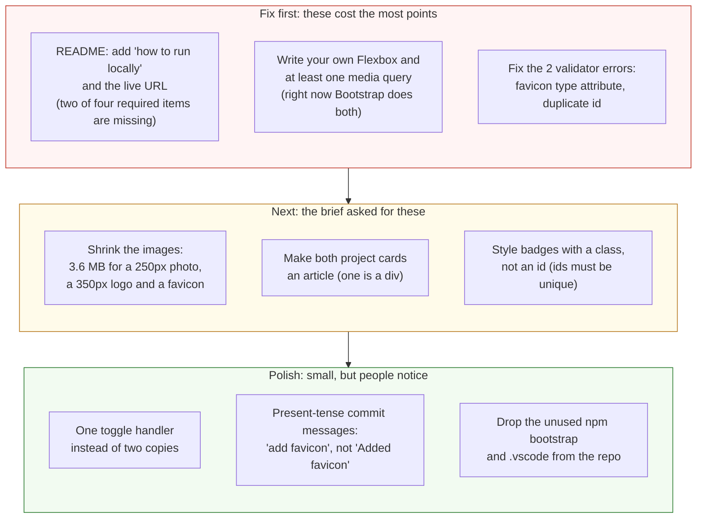

# Project 1: Static Foundations — Feedback

**Student:** Arvind Anthey · **Repo:** [aanthey/portfolio-site](https://github.com/aanthey/portfolio-site) · **Live:** [arvindanthey.netlify.app](https://arvindanthey.netlify.app/)
**Reviewed at commit:** `f4bd512` · **Course:** CSC 436, Fall 2026

> **How this review was made.** Your instructor reviewed this project with [Claude](https://claude.com) (Anthropic's AI) as a second set of eyes. Claude cloned the repo, read every line, loaded the live site at phone, tablet and desktop widths, ran the W3C validator, opened the hamburger menu, and clicked both toggles. Every note and every point below was read and approved by your instructor. Same standard, same rubric, just more time spent looking at *your* code than one human has in a grading week.

## Grade: 81 / 100

| Category | Points | Earned | One line |
|---|:-:|:-:|---|
| Semantic HTML | 20 | 16 | Right elements, clean headings; two validator errors and one card is a `div` |
| CSS layout | 25 | 20 | Your Grid is great; every Flexbox on the page belongs to Bootstrap |
| Responsive design | 15 | 13 | No horizontal scroll anywhere; zero media queries of your own |
| JavaScript interaction | 15 | 13 | Accessible toggles done right, written twice |
| Repository and deployment | 15 | 11 | Real commit history over 12 days; README is missing half its required items |
| Content and polish | 10 | 8 | Real projects, real photo, alt text everywhere; 3.7 MB of images for a one-page site |
| **Total** | **100** | **81** | **Good process, thoughtful details, but Bootstrap did the part the brief was testing.** |

## The short version

This is a real portfolio. Real projects with real repos, a real photo with real alt text, a `<time>` element with a `datetime` attribute, `aria-expanded` kept in sync by hand, a `:focus-visible` style you wrote yourself. Those are details most students don't know exist yet. And your commit history is what the brief asked for: eleven commits across twelve days, each one a feature.

Here's the problem. Project 1 is a review of *your* HTML, CSS and JavaScript. Open `styles.css` and search for `display: flex`. Zero. Search for `@media`. Zero. The navbar, its mobile collapse, the flex layouts inside the cards, the page container: all Bootstrap. Your own CSS is genuinely good where it exists, but the brief said "Flexbox and Grid, both" and "mobile-first media queries," and you wrote one of those four things. That's where the points went.

## What the numbers looked like

Things Claude measured on the live site (so you know these aren't guesses):

| Check | Result |
|---|---|
| Horizontal scroll at 375 / 768 / 1280 px | None at any width |
| Project grid columns at 375 / 768 / 1280 | 1 / 2 / 2 |
| Hamburger menu at 375px | Opens, 4 links, closes |
| Both "My contributions" toggles | Work; `hidden`, `aria-expanded` and label all update |
| Console errors | 0 |
| W3C HTML validator | 2 errors (favicon `type`, duplicate `id`) |
| Heading order | h1 → h2 → h3, no skipped levels |
| `display: flex` in styles.css | 0 rules |
| `@media` in styles.css | 0 rules |
| Image weight in `assets/` used by the page | 3.7 MB (photo 1.07 MB, PAWS logo 1.54 MB, favicon 1.13 MB) |
| Commits | 11, from Sep 3 to Sep 15 |

---

## Semantic HTML — 16 / 20

**What's working**

- `header`, `nav`, `main`, `section`, `article`, `footer` all present and correctly placed. Nav is a real `ul > li > a`. One `h1`, then `h2` per section, `h3` per card. No skipped levels.
- `<time datetime="2025-07">` ([index.html L54–55](https://github.com/aanthey/portfolio-site/blob/f4bd512/index.html#L54-L55)). Nobody asked for that. It's the right element and you used it.
- The toggle buttons carry `aria-expanded` and `aria-controls` ([L76](https://github.com/aanthey/portfolio-site/blob/f4bd512/index.html#L76), [L101](https://github.com/aanthey/portfolio-site/blob/f4bd512/index.html#L101)), and the hidden paragraphs use the `hidden` attribute instead of a CSS hack. `rel="noopener noreferrer"` on every external link. `<meta name="description">` in the head. This is careful work.

**What to change**

- **Two validator errors.** [L10](https://github.com/aanthey/portfolio-site/blob/f4bd512/index.html#L10): `type="AA Lofi Icon"` is not a MIME type. The `type` attribute on a `<link rel="icon">` wants `image/png`, or just leave it off. [L111](https://github.com/aanthey/portfolio-site/blob/f4bd512/index.html#L111): `id="supabase-badge"` appears twice ([L87](https://github.com/aanthey/portfolio-site/blob/f4bd512/index.html#L87) is the first). An `id` must be unique on the page. This one happened because you're styling badges by `id` instead of by class, which brings us to:
- **Style with classes, not ids.** `#react-badge`, `#node-badge`, `#supabase-badge` ([styles.css L193–207](https://github.com/aanthey/portfolio-site/blob/f4bd512/styles.css#L193-L207)) means you can never use the same badge twice without a validator error. You already did it right once: `.project-tech` on [L110](https://github.com/aanthey/portfolio-site/blob/f4bd512/index.html#L110). Make them all `.badge-react`, `.badge-node`, and so on.
- **One card is a `div`, one is an `article`.** PAWS is `<div class="card">` ([L68](https://github.com/aanthey/portfolio-site/blob/f4bd512/index.html#L68)), SquadCheck is `<article class="card">` ([L94](https://github.com/aanthey/portfolio-site/blob/f4bd512/index.html#L94)). They're the same kind of thing. Both should be `article`.
- **`div.page` wrapping everything** ([L14](https://github.com/aanthey/portfolio-site/blob/f4bd512/index.html#L14)) so you can put `font-family`, `background-color` and `margin: 0` on it ([styles.css L2–7](https://github.com/aanthey/portfolio-site/blob/f4bd512/styles.css#L2-L7)). That's what `body` is for. Move those rules to `body` and delete the wrapper.

## CSS layout — 20 / 25

**What's working**

- **The project grid is exactly right.** `repeat(auto-fit, minmax(min(100%, 280px), 1fr))` ([styles.css L39–44](https://github.com/aanthey/portfolio-site/blob/f4bd512/styles.css#L39-L44)). The `min(100%, 280px)` guard is a detail most tutorials skip, and it's the reason your cards never overflow a narrow phone. `align-items: start` so cards don't stretch to match each other. This is the best Grid rule in the class so far.
- Spacing and type are deliberate: `clamp()` for the name and section padding, `65ch` and `75ch` max widths on prose, a consistent card treatment (same background, border, radius, shadow) reused across About, Experience and Projects. The `h2::after` underline is a nice touch.
- You wrote a `:focus-visible` style ([L185–188](https://github.com/aanthey/portfolio-site/blob/f4bd512/styles.css#L185-L188)). Keyboard users thank you.

**What to change**

- **You didn't write any Flexbox.** Every flex layout on the page is a Bootstrap utility class: `d-flex flex-column align-items-start gap-2` ([index.html L82](https://github.com/aanthey/portfolio-site/blob/f4bd512/index.html#L82), [L107](https://github.com/aanthey/portfolio-site/blob/f4bd512/index.html#L107)), `d-flex gap-3` ([L121](https://github.com/aanthey/portfolio-site/blob/f4bd512/index.html#L121)), and the entire navbar. The brief says Flexbox "must do real layout work somewhere on the site." Bootstrap's does. Yours doesn't exist. This is the biggest single deduction on the sheet, and it's fixable in an afternoon: write the navbar yourself (`display: flex; justify-content: center; gap: ...`), and replace the `d-flex` utilities with your own class.

  ```mermaid
  flowchart TB
      subgraph you["styles.css: 231 lines you wrote"]
          direction TB
          y1["display: grid<br/>.project-grid, auto-fit + minmax<br/><b>Grid: yours, and good</b>"]
          y2["display: flex<br/><b>0 rules</b>"]
          y3["@media queries<br/><b>0 rules</b>"]
      end
      subgraph bs["bootstrap.min.css: 0 lines you wrote"]
          direction TB
          b1[".navbar .navbar-expand-lg<br/>the whole nav layout<br/>and its mobile collapse"]
          b2[".d-flex .flex-column .gap-2<br/>every Flexbox on the page"]
          b3[".container<br/>page width and side padding"]
      end
      you -.->|"the brief grades this column"| bs
      style y1 fill:#e3f4e1,stroke:#2e7d32,color:#111
      style y2 fill:#fde2e2,stroke:#c0392b,color:#111
      style y3 fill:#fde2e2,stroke:#c0392b,color:#111
      style b1 fill:#fff4d6,stroke:#b7791f,color:#111
      style b2 fill:#fff4d6,stroke:#b7791f,color:#111
      style b3 fill:#fff4d6,stroke:#b7791f,color:#111
  ```

- **`display: table` to shrink-wrap the title pill** ([L28](https://github.com/aanthey/portfolio-site/blob/f4bd512/styles.css#L28)). It works, but it's a 2008 trick. `width: fit-content` is what you mean.
- **Bootstrap is loaded twice.** The page uses the CDN ([index.html L7](https://github.com/aanthey/portfolio-site/blob/f4bd512/index.html#L7), [L133](https://github.com/aanthey/portfolio-site/blob/f4bd512/index.html#L133)), and `package.json` also installs it from npm, which nothing references. Pick one. For a static site with no build step, the CDN is the one to keep, so remove the npm dependency, or just delete `package.json` and `package-lock.json` entirely.

## Responsive design — 13 / 15

**What's working**

- No horizontal scroll at 375, 768 or 1280. Cards go from one column to two. The hamburger appears under 992px, opens, shows all four links, closes. The profile photo is `max-width: 100%` with `aspect-ratio: 1` and `object-fit: cover`, so it never distorts.
- The `min(100%, 280px)` trick means your grid is responsive with zero breakpoints. The brief explicitly allows intrinsic patterns like this, so you get credit for it.

**What to change**

- **Zero media queries.** The brief says "mobile-first media queries." The only thing on your page that changes behavior at a breakpoint is Bootstrap's navbar, and Bootstrap wrote that. Write at least one: the header is a good candidate (smaller photo and tighter padding under 600px), and once you own the navbar you'll need one for it anyway.
- The grid tops out at two columns on a 1280px desktop because there are only two projects. Fine for now, but when you add a third, check that `280px` minimum still gives you the layout you want.

## JavaScript interaction — 13 / 15

**What's working**

- The toggle is the right design: flip the `hidden` attribute, update `aria-expanded`, change the button label. Screen readers get the state, sighted users get the label, and there's no CSS class juggling. Arrow functions, `const`, comments that explain why. Zero console errors.
- Using `hidden` instead of toggling a `.show` class is the correct choice and most students get this wrong.

**What to change**

- **The whole file is written twice.** Lines [2–15](https://github.com/aanthey/portfolio-site/blob/f4bd512/scripts.js#L2-L15) and [17–28](https://github.com/aanthey/portfolio-site/blob/f4bd512/scripts.js#L17-L28) are the same code with different ids. When you add a third project you'd copy it again. You already gave every button the same class and an `aria-controls` that names its target, so the loop writes itself:

  ```js
  document.querySelectorAll('.contribution-toggle').forEach((button) => {
      const details = document.getElementById(button.getAttribute('aria-controls'));
      button.addEventListener('click', () => {
          details.hidden = !details.hidden;
          button.setAttribute('aria-expanded', String(!details.hidden));
          button.textContent = details.hidden ? 'My contributions' : 'Hide my contributions';
      });
  });
  ```

  ```mermaid
  flowchart TB
      subgraph now["scripts.js now: 28 lines, two copies of the same idea"]
          direction LR
          n1["#squadcheck-toggle<br/>click handler<br/>lines 2 to 15"]
          n2["#paws-toggle<br/>click handler<br/>lines 17 to 28"]
          n3["(third project?)<br/>copy-paste again"]
          n1 ~~~ n2 ~~~ n3
      end
      subgraph next["One handler for every toggle, ever"]
          direction TB
          m1["querySelectorAll('.contribution-toggle')"] --> m2["for each button:<br/>target = document.getElementById(button.getAttribute('aria-controls'))"] --> m3["on click: flip target.hidden,<br/>sync aria-expanded and the label"]
      end
      now ==>|"same behavior, about 12 lines,<br/>and a new project card needs zero new JS"| next
      style n1 fill:#fff4d6,stroke:#b7791f,color:#111
      style n2 fill:#fff4d6,stroke:#b7791f,color:#111
      style n3 fill:#fde2e2,stroke:#c0392b,color:#111,stroke-dasharray: 5 5
      style m1 fill:#e3f4e1,stroke:#2e7d32,color:#111
      style m2 fill:#e3f4e1,stroke:#2e7d32,color:#111
      style m3 fill:#e3f4e1,stroke:#2e7d32,color:#111
  ```

- Small: the label strings live in two places (the HTML and the JS). If you ever rename the button, you'll rename it in one and not the other. Consider a `data-label-open` attribute on the button, or accept it for now and just know it's there.

## Repository and deployment — 11 / 15

**What's working**

- **The history is what the brief asked for.** Eleven commits from September 3 to 15: skeleton, then Bootstrap and the first project, then SquadCheck, then Experience, then the toggles, then favicon, then tweaks. Anyone reading the log can watch the site get built. That's the point, and you did it.
- `.gitignore` covers `node_modules`. Live URL works in a private window and matches the repo at `f4bd512`. Netlify deploys on push.

**What to change**

- **README is half done.** The brief lists four required items: title, description, how to run locally, live URL. You have the first two. The README hasn't been touched since September 3, before there was a site to run or a URL to link. Add a "Run locally" section (clone, open `index.html` or use Live Server) and the Netlify URL. Ten minutes.
- **Commit messages are past tense.** `Added favicon logo`, `Added a Work Experience section`. The brief asked for present tense: `add favicon`, `add work experience section`. It's a convention, and it's the one the rest of the industry uses, so build the habit now.
- **Repo clutter.** `.vscode/settings.json` is your editor's preference, not the project's, and belongs in your global gitignore. `package.json` / `package-lock.json` install a dependency the page never loads (see CSS notes). Either use them or remove them.

## Content and polish — 8 / 10

**What's working**

- It's real. Two projects with links to real repos and honest, specific "my contributions" text. A real bio. A real photo. Every image has meaningful alt text. A favicon. Consistent palette (the purple, cream and slate work together) and consistent card treatment. The `:focus-visible` ring matches the brand color. This is a site you could actually send to a recruiter.

**What to change**

- **3.7 MB of images.** The profile photo is 3024×4032 pixels and 1.07 MB, displayed at 250px. The PAWS logo is 1024×1024 and 1.54 MB, displayed at 350px. The favicon is 1254×1254 and 1.13 MB, displayed at 16px. That's a full second or two on a phone connection for a page that has three images. Resize them to roughly twice their display size (the photo to about 600px wide, the logo to about 700px, the favicon to 64px), export as JPEG or WebP for the photo, and the whole `assets` folder drops under 200 KB.
- **The two project cards don't match.** PAWS has a logo, SquadCheck has nothing. Either give SquadCheck an image (a screenshot works) or take the PAWS logo out of the card and let both stand on text. Uneven cards read as unfinished.

---

## Your next three moves



1. **Own the navbar.** Delete the Bootstrap navbar markup, write it with `display: flex`, and add a `@media (min-width: 600px)` for the desktop version. That's Flexbox and a media query in one move, and it's most of the missing points.
2. **Finish the README.** Two sections, ten minutes.
3. **Fix the validator errors and shrink the images.** Both are quick, and both are things a recruiter's browser will notice before they read a word.

Your instincts on accessibility and process are ahead of the class. Now put the same care into the CSS you're supposed to be practicing.

*This PR only adds feedback files. It does not touch your code. Merge it, close it, or just read it, your call. Questions go to office hours or the Brightspace board.*
